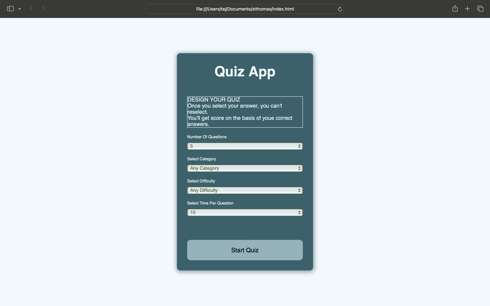

# project 3: Online Quiz 


>Build Online Quiz App with 4 choice of options for each attempt

## Project Brief
The online quiz would be a website where users can answer a series of questions and receive score on their performance. The quiz would have questions with multiple-choice options, and navigation buttons (like 'Next' and 'Submit'). Each question could be displayed on its own page or section. 

#### Technologies

- HTML
- CSS
- Javascript
- Markdown
- Visual Studio Code

#### Parameters

- Number Of Questions
- Category
- Difficuilty
- Time Per Question


#### API Reference
`````javascript
https://opentdb.com/api.php?amount=${num}&category=${cat}&difficulty=${diff}&type=multiple;
`````


## Reference
- website - https://hyderabad-2010.github.io/Online-Quiz/
